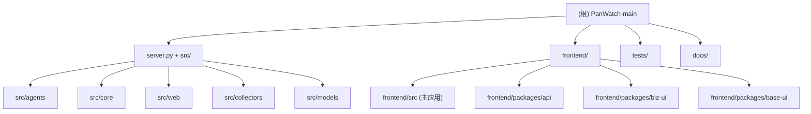

# PanWatch · CLAUDE.md

> 生成时间：2026-03-22 19:55:32 | 更新策略：增量

## 项目概述

PanWatch（盯盘侠）是一个面向个人投资者的 AI 驱动股票监控平台。后端基于 Python/FastAPI，通过可调度的 AI Agent 定时采集行情、新闻、K 线数据，借助 LLM 生成分析报告并推送到 Telegram 等通知渠道。前端为 React + TypeScript PWA，支持桌面端和移动端，提供持仓管理、价格提醒、机会发现、MCP 工具调用等功能。项目支持 Docker 单容器一键部署，数据持久化到 SQLite。

## 架构总览



## 模块索引

| 模块 | 路径 | 职责 | 文档 |
|------|------|------|------|
| 服务入口 | `server.py` | 统一启动：FastAPI app + 三个调度器生命周期管理 | 本文件 |
| Agents | `src/agents/` | 6 个 AI 分析 Agent：盘前/盘中/收盘/基金/新闻/图表 | [CLAUDE.md](./src/agents/CLAUDE.md) |
| Core | `src/core/` | 调度器、AI 客户端、通知、策略引擎、上下文存储等基础能力 | [CLAUDE.md](./src/core/CLAUDE.md) |
| Web API | `src/web/` | FastAPI 路由、SQLAlchemy 数据模型、数据库迁移 | [CLAUDE.md](./src/web/CLAUDE.md) |
| Collectors | `src/collectors/` | 行情/新闻/K线/资金流/基金/截图等数据采集器 | [CLAUDE.md](./src/collectors/CLAUDE.md) |
| Models | `src/models/` | 共享 Pydantic/枚举数据类型（MarketCode 等） | 见 src/models/market.py |
| Frontend | `frontend/` | React 18 + Vite + TailwindCSS 单页应用 | [CLAUDE.md](./frontend/CLAUDE.md) |
| API Package | `frontend/packages/api/` | 前端 HTTP 客户端封装，类型定义 | [CLAUDE.md](./frontend/packages/api/CLAUDE.md) |
| biz-ui Package | `frontend/packages/biz-ui/` | 业务组件库：K线、基金图表、AI 建议卡片等 | [CLAUDE.md](./frontend/packages/biz-ui/CLAUDE.md) |
| base-ui Package | `frontend/packages/base-ui/` | 基础 UI 组件库：Button、Dialog、Toast 等 | [CLAUDE.md](./frontend/packages/base-ui/CLAUDE.md) |
| Tests | `tests/` | Python 后端单元/集成测试（pytest） | 见 tests/ 目录 |

## 开发规范

### 常用命令

#### 后端启动（本地开发）
```bash
# 安装依赖
pip install -r requirements.txt

# 启动（热重载，访问 http://127.0.0.1:8000）
python server.py

# API 文档
open http://127.0.0.1:8000/docs
```

#### 前端启动（本地开发）
```bash
cd frontend
pnpm install
pnpm dev   # 代理到后端 :8000
```

#### Docker 一键部署
```bash
docker build -t panwatch .
docker run -d -p 8000:8000 \
  -e AI_API_KEY=your_key \
  -v $(pwd)/data:/app/data \
  panwatch
```

#### 测试
```bash
# 运行所有 Python 测试
pytest tests/

# 运行单个测试文件
pytest tests/test_mcp_tools.py -v
```

#### 前端构建
```bash
cd frontend
pnpm build   # 输出到 frontend/dist/，Dockerfile 会将其复制到 static/
```

### 环境变量（.env）

| 变量 | 默认值 | 说明 |
|------|--------|------|
| `AI_API_KEY` | `""` | AI 服务 API 密钥 |
| `AI_BASE_URL` | `https://open.bigmodel.cn/api/paas/v4` | AI 接口地址（兼容 OpenAI） |
| `AI_MODEL` | `glm-4` | 使用的模型名 |
| `NOTIFY_TELEGRAM_BOT_TOKEN` | `""` | Telegram Bot Token |
| `NOTIFY_TELEGRAM_CHAT_ID` | `""` | Telegram Chat ID |
| `HTTP_PROXY` | `""` | 代理地址 |
| `TZ` | `Asia/Shanghai` | 时区（调度和展示） |
| `DOCKER` | `""` | 设为 `1` 时启用 Docker 模式（Playwright 安装到 data 目录） |
| `DATA_DIR` | `./data` | 数据目录（SQLite + Playwright 浏览器） |
| `PLAYWRIGHT_SKIP_BROWSER_INSTALL` | `""` | 设为 `1` 跳过浏览器安装（不需要 K 线截图时） |

### 代码风格

- **Python**：PEP 8，类型注解，dataclass 优先于 dict 传参，async/await 处理 IO
- **TypeScript**：严格模式，函数式组件 + React Hooks，Tailwind CSS 样式
- **命名**：后端 snake_case，前端 camelCase/PascalCase（组件）
- **导入**：前端包通过 pnpm workspace 别名引用（`@panwatch/api`、`@panwatch/biz-ui`、`@panwatch/base-ui`）

### 测试策略

- 后端：`pytest` + `requests` 集成测试为主，覆盖 MCP 工具、数据源、调度器等核心流程
- 测试文件位于 `tests/`，命名规则：`test_<feature>.py`
- 无前端自动化测试（当前版本）
- MCP 工具测试需要运行中的服务（`tests/test_mcp_tools.py` 是端到端测试脚本）

## 关键文件

| 文件 | 说明 |
|------|------|
| `server.py` | 应用主入口：初始化 DB、启动三个调度器、注册 Agent、挂载静态文件 |
| `src/config.py` | `Settings`（pydantic-settings）+ `AppConfig` + `StockConfig` 数据类 |
| `src/web/models.py` | 所有 SQLAlchemy ORM 模型（25+ 张表） |
| `src/web/database.py` | SQLite 引擎、迁移逻辑、`init_db()` |
| `src/web/app.py` | FastAPI app 实例，注册所有 API 路由 |
| `src/agents/base.py` | `BaseAgent` 抽象基类、`AgentContext`、`AnalysisResult` |
| `src/core/agent_catalog.py` | Agent 种子配置（名称、调度、执行模式） |
| `src/core/scheduler.py` | APScheduler 调度器封装 |
| `src/core/price_alert_scheduler.py` | 价格提醒定时轮询（每 60 秒） |
| `src/core/context_scheduler.py` | 上下文维护调度器（每 6 小时） |
| `frontend/src/App.tsx` | 前端路由、导航、认证守卫 |
| `frontend/vite.config.ts` | Vite 配置、路径别名、API 代理 |
| `Dockerfile` | 多阶段构建：Node 20 构建前端 + Python 3.11 运行后端 |
| `requirements.txt` | Python 依赖清单 |

## AI 使用指引

- **不修改 `src/web/models.py`** 时无需跑数据库迁移，新增字段需在 `src/web/database.py` 的 `_migrate()` 函数中补充 ALTER TABLE 语句
- Agent 开发：继承 `BaseAgent`，实现 `collect()` 和 `build_prompt()` 方法，在 `server.py` 的 `AGENT_REGISTRY` 中注册，并在 `src/core/agent_catalog.py` 的 `AGENT_SEED_SPECS` 中添加种子配置
- 新增 API 路由：在 `src/web/api/` 目录新建模块，在 `src/web/app.py` 中 `include_router`
- 新增数据采集器：在 `src/collectors/` 中添加，遵循现有 Collector 的接口模式
- 前端新增页面：在 `frontend/src/pages/` 创建组件，在 `frontend/src/App.tsx` 注册路由

## 变更记录 (Changelog)

| 时间 | 变更内容 |
|------|----------|
| 2026-03-22 19:55:32 | 初次生成 CLAUDE.md，全仓扫描覆盖率约 85% |
