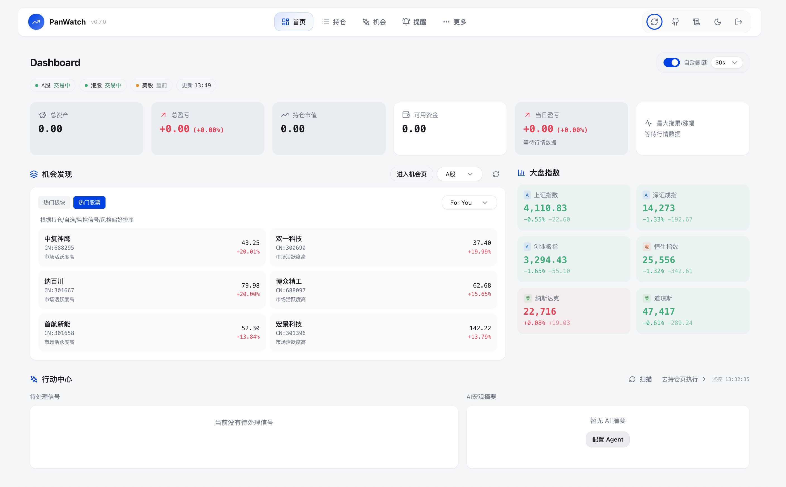
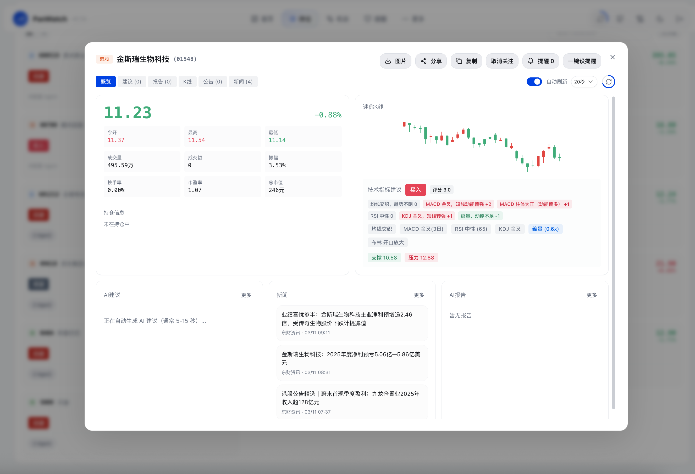
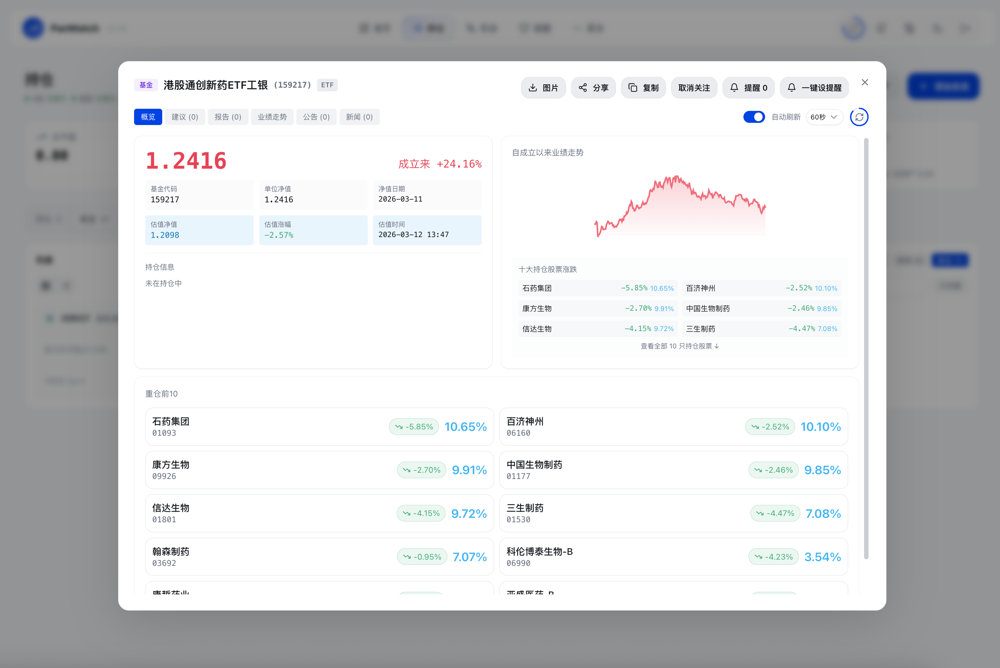
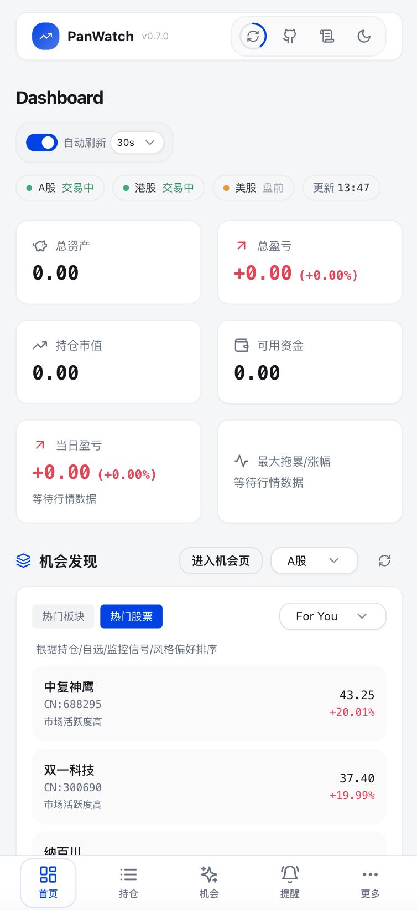

# Pan1Watch

私有部署的 AI 股票/基金助手，聚焦盯盘、分析、通知与执行建议。

[](LICENSE)

## 项目定位

Pan1Watch 面向希望「数据不出本地」的投资者和量化交易爱好者，提供从行情监控到 AI 分析再到多渠道推送的一体化能力。

- 数据私有：自托管部署，持仓与配置均落在你自己的环境
- AI 原生：围绕持仓上下文进行分析，不是单纯指标罗列
- MCP 原生：标准 JSON-RPC 接口，可直接接入支持 MCP 的客户端
- 开箱即用：Docker 一条命令启动

## 截图预览



| 股票详情                                         | 基金详情                                         | 移动端                                 |
| ------------------------------------------------ | ------------------------------------------------ | -------------------------------------- |
|  |  |  |

## 功能概览

### 智能 Agent 系统

| Agent    | 触发时机     | 功能                                       |
| -------- | ------------ | ------------------------------------------ |
| 盘前分析 | 每日开盘前   | 综合隔夜市场、新闻与技术形态，生成当日策略 |
| 盘中监测 | 交易时段实时 | 监控异动与指标共振，触发提醒               |
| 盘后日报 | 每日收盘后   | 复盘走势、分析资金流向、规划次日关注       |
| 新闻速递 | 定时采集     | 抓取并筛选与持仓高度相关的财经信息         |

### 专业技术分析

- 趋势指标：MA、MACD、布林带
- 动量指标：RSI、KDJ
- 量价分析：量比、缩量回调、放量突破
- K 线形态：锤子线、吞没形态、十字星等
- 支撑压力：自动计算关键位

### 多市场与多账户

- 覆盖市场：A 股、港股、美股
- 账户体系：多券商账户独立管理与资产汇总
- 风格适配：短线、波段、长线策略差异化建议

### 通知与提醒

- 通知渠道：Telegram、企业微信、钉钉、飞书、Bark、自定义 Webhook
- 价格提醒：支持价格/涨跌幅/成交额/量比等条件组合
- 策略控制：支持冷却时间、日触发上限、交易时段限制等

## 快速开始

### Docker 一键启动

```bash
docker run -d \
  --name pan1watch \
  -p 8000:8000 \
  -v pan1watch_data:/app/data \
  ghcr.io/windfgg/pan1watch:latest
```

启动后访问 http://localhost:8000，首次进入按页面引导创建账号。

说明：镜像内已包含 Playwright 所需系统依赖；Chromium 会在首次启动时自动下载到 /app/data/playwright。

如果不需要截图能力，可设置环境变量跳过安装：

```bash
PLAYWRIGHT_SKIP_BROWSER_INSTALL=1
```

### Docker Compose

```yaml
version: '3.8'
services:
  pan1watch:
    image: ghcr.io/windfgg/pan1watch:latest
    container_name: pan1watch
    ports:
      - "8000:8000"
    volumes:
      - pan1watch_data:/app/data
    restart: unless-stopped

volumes:
  pan1watch_data:
```

```bash
docker compose up -d
```

## 首次配置

1. 设置登录账号密码
2. 在设置页配置 AI 服务商（OpenAI 兼容接口）
3. 配置通知渠道（如 Telegram）
4. 添加持仓与自选，启用对应 Agent

## 环境变量

| 变量名                          | 说明                   | 默认值         |
| ------------------------------- | ---------------------- | -------------- |
| AUTH_USERNAME                   | 预设登录用户名         | 首次访问时设置 |
| AUTH_PASSWORD                   | 预设登录密码           | 首次访问时设置 |
| JWT_SECRET                      | JWT 签名密钥           | 自动生成       |
| DATA_DIR                        | 数据存储目录           | ./data         |
| TZ                              | 应用时区               | Asia/Shanghai  |
| PLAYWRIGHT_SKIP_BROWSER_INSTALL | 跳过 Chromium 首次安装 | 未设置         |

## 本地开发

环境要求：Python 3.10+、Node.js 18+、pnpm。

```bash
# 后端
python -m venv .venv
source .venv/bin/activate
pip install -r requirements.txt
python server.py

# 前端（新终端）
cd frontend
pnpm install
pnpm dev
```

前端默认运行在 http://localhost:5173，并代理到后端 API。

## MCP 接口

Pan1Watch 提供标准 JSON-RPC over HTTP 的 MCP 接口：/api/mcp。

- 认证方式：Bearer（推荐）或 Basic
- 协议能力：initialize、tools/list、tools/call
- 主要工具：持仓管理、市场数据查询、Dashboard 概览、诊断工具


## 发布说明

打 tag后会自动构建并推送镜像：

- ghcr.io/windfgg/pan1watch:<tag>
- ghcr.io/windfgg/pan1watch:latest

## 贡献

欢迎提交 Issue 和 PR。开发规范见 CONTRIBUTING.md。

## License

MIT
